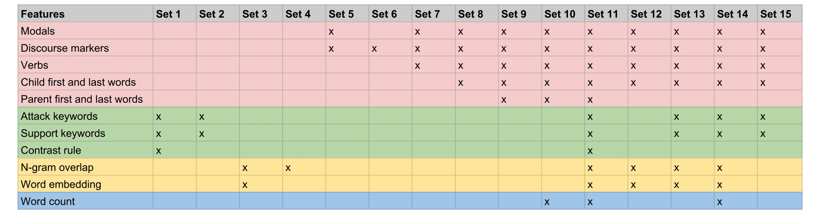
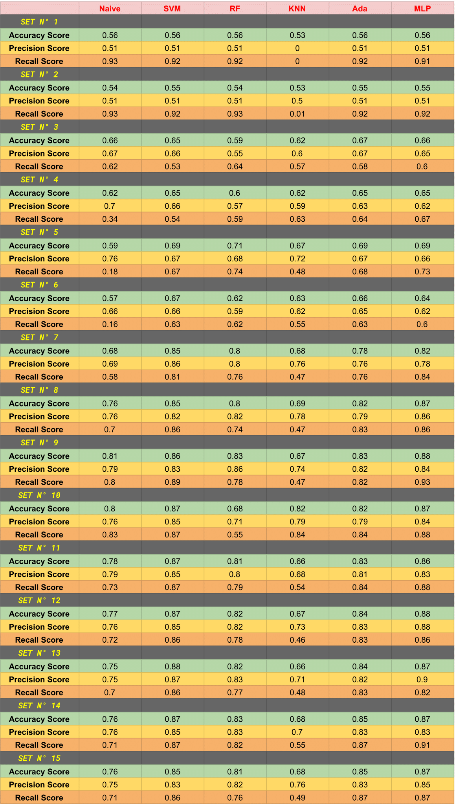
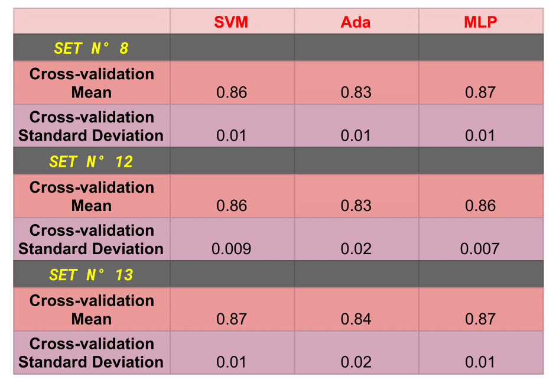
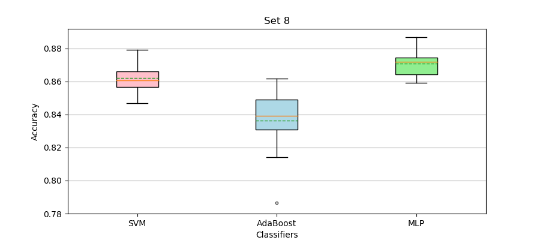
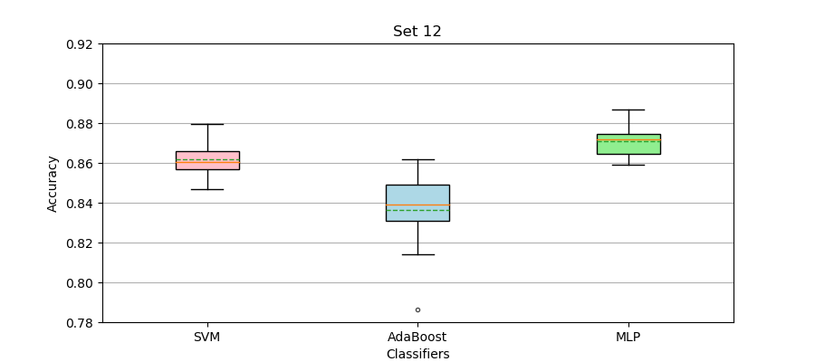
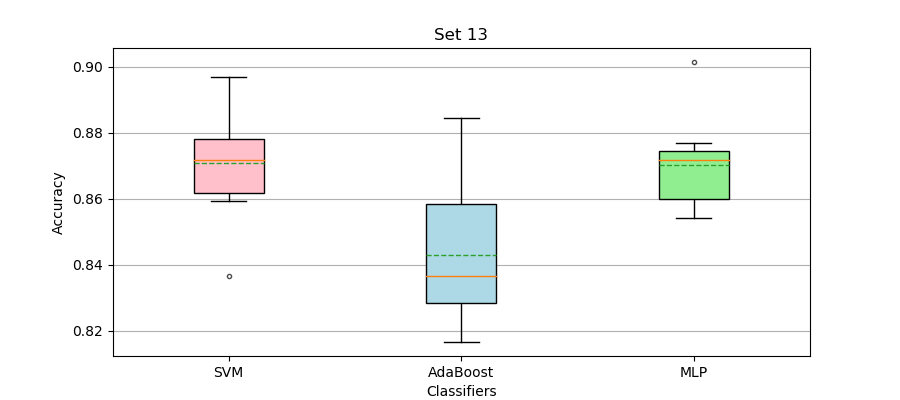

# Identifying argumentative relations on Reddit CMV

## Introduction

The goal of this project is to build a classifier that identifies attack and support argumentative relations between pairs of comments in online debates. We used the [Change My View (CMV) subreddit](https://www.reddit.com/r/changemyview/) as a corpus. We chose this forum because its content is mainly argumentative and because it is ruled by guidelines that make the construction of a dataset easier.

## Data structure

We built a tree structure for each submission, where the main post is the root and the comments are nodes of first-level, second-level and so on. With this structure it is easier to get the full path from the root to a certain leaf by running DFS.

## Preprocessing

The [PRAW API](https://praw.readthedocs.io/en/latest/) offers an interface for downloading Reddit submissions. The submission title, the submission text, and all the comments can be retrieved with an ID (which is unique for each comment). In addition, it is possible to check for the parent of a given comment, which is how we were able to build the tree structure. 

Then we sanitized the data, leaving only alphanumeric characters and dots. We replaced the links with the keyword “linkx” and quotes with the keyword “quotex”. We also filtered the hidden text and all the comments marked as “removed” or “deleted”.

After cleansing, we ran DFS for each submission to get the full path, starting from the root and ending at the leaves (last comments) of each thread.

For each thread, we took all the possible pairs of parent-child combinations. We repeated this process for each [CMV category](https://praw.readthedocs.io/en/latest/getting_started/quick_start.html#obtain-submission-instances-from-a-subreddit).

## Dataset

According to one of the [subreddit's rules](https://www.reddit.com/r/changemyview/wiki/rules), "direct responses to a CMV post must challenge at least one aspect of OP’s current view." Based on this assumption, we extracted all the post and first-level comment tuples and labeled them as positive. We got 31580 positive examples.

We were able to spot a significant number of support relations thanks to the [Delta System](https://www.reddit.com/r/changemyview/wiki/deltasystem), a set of rules that encourages users to reply to comments that changed their view with a delta symbol and an explanation of the change. This explanation can thus be considered to be in a support relation to its parent. Whenever someone awards a delta, a [DeltaBot](https://www.reddit.com/r/changemyview/wiki/deltasystem#wiki_deltabot_code) ensures that the rules are being followed and confirms the award. We identified 4262 negative tuples with this method. However, due to bugs in the DeltaBot, a large number of examples weren't correct. We filtered non-support tuples by eliminating those that didn't contain the word "delta" or a delta symbol in the child. We were left with 1841 tuples.

In addition, we extracted 846 tuples that mentioned support keywords or phrases like "i agree", "that's true" and "see your point" in the child. We then hand-labeled 148 of this candidate tuples as negative.

As the number of positive examples was a lot larger than the number of negative ones, we undersampled the positive dataset to 1989 tuples.

## Feature engineering

We built this initial set of features:

- **Modals.** We counted the frequency of modals in parent and child, following the intuition that arguments in a support relation have more modals in common or use the same type of modals (Stab & Gurevych, 2014) . We created a list of lemmas, differentiating positives (e.g., “can”) from negatives (e.g., “can’t). We also built a modals dictionary to spot variations of these basic forms (e.g., “cannot”, “can not”) in the text.

- **Discourse markers.** We extracted all the discourse markers in the child, as they are often explicit indicators of the type of argumentative relation (Stab & Gurevych, 2014). We used the list of English discourse markers provided by [Connective-Lex](http://connective-lex.info/).

- **Verbs.** We extracted the verbs from parent and child (but considered them separately), since they are believed to convey relevant argumentative information (Stab & Gurevych, 2014). We tokenized, PoS-tagged and lemmatized the text with [spaCy](https://spacy.io/), and counted the frequency of each verb.

- **First and last words of the child.** Because of its position, the first and last words of the children can be useful for predicting whether it supports or attacks its parent. For example, these keywords may be connectives not included in our discourse markers list (Pitler et al., 2009).

- **First and last words of the parent.** We also extracted the first and last words of the parent to evaluate if it adds any other useful information in conjunction to those of the child.

- **Support keywords.** We used the same list of support keywords and phrases with which we extracted candidate negative examples as a feature. We checked for the presence of these keywords in the child.

- **Attack keywords.** We also curated a list of attack keywords and phrases and looked for them in the child.

- **Contrast rule.** We spotted a frequent support structure in the children, so we created a rule to detect all the strings that followed a support keyword + optional string + contrast discourse marker pattern (e.g., “i agree with your points but…”).

- **N-gram overlap.** Following the intuition that comments in a support relation are more similar to each other, we computed document similarity via n-gram overlap. We searched for the overlapping of 1-grams, 2-grams and 3-grams between parent and child.

- **Word embedding.** We also used word embeddings to compute the semantic similarity between parent and child (Cocarascu & Toni, 2017). We used the [doc2vec algorithm provided by spaCy](https://spacy.io/usage/vectors-similarity).

- **Word count.** We noticed that children in attack relations tend to be longer than those in support relations, so we counted the number of words in children as a feature.

We tried different combinations of these features to evaluate the relevance of each and find the optimal set.

## Vectorization

We extracted a dictionary of features for each parent-child tuple. Then we transformed our dictionaries of features to vectors using the [DictVectorizer](http://scikit-learn.org/stable/modules/generated/sklearn.feature_extraction.DictVectorizer.html) function from Scikit Learn.

## Classifiers

We tried the following classifiers (descriptions are taken from the scikit-learn documentation):

- [GaussianNB](http://scikit-learn.org/stable/modules/generated/sklearn.naive_bayes.GaussianNB.html): Naive Bayes methods are a set of supervised learning algorithms based on applying Bayes’ theorem with the “naive” assumption of independence between every pair of features. 

- [Support Vector Machines](http://scikit-learn.org/stable/modules/svm.html): SVMs are a set of supervised learning methods used for classification, regression and outliers detection.

- [Random Forest](http://scikit-learn.org/stable/modules/generated/sklearn.ensemble.RandomForestClassifier.html): A RF is a meta estimator that fits a number of decision tree classifiers on various subsamples of the dataset and uses averaging to improve the predictive accuracy and control overfitting. 

- [K-Nearest Neighbors](http://scikit-learn.org/stable/modules/generated/sklearn.neighbors.KNeighborsClassifier.html): Classifier implementing the [k-nearest neighbors vote](https://en.wikipedia.org/wiki/K-nearest_neighbors_algorithm).

- [AdaBoostClassifier](http://scikit-learn.org/stable/modules/generated/sklearn.ensemble.AdaBoostClassifier.html): An AdaBoost classifier is a meta-estimator that begins by fitting a classifier on the original dataset and then fits additional copies of the classifier on the same dataset but where the weights of incorrectly classified instances are adjusted such that subsequent classifiers focus more on difficult cases.

- [Multi-layer Perceptron classifier](http://scikit-learn.org/stable/modules/generated/sklearn.neural_network.MLPClassifier.html#sklearn.neural_network.MLPClassifier): MLP is a supervised learning algorithm that learns a function by training on a dataset. Given a set of features and a target, it can learn a non-linear function approximator for either classification or regression.

## Evaluation

To evaluate the performance of our models, we splitted the dataset in two halves: 80% for training and 20% for testing. We tried every combination of feature sets and classifiers and calculated the accuracy, precision and recall scores. 

We selected the highest-performing feature sets (8, 12 and 13) and the classifiers that achieved the best scores (SVM, AdaBoost and MLP). We then measured overfitting in these models by calling scikit-learn’s [cross_val_score](http://scikit-learn.org/stable/modules/generated/sklearn.model_selection.cross_val_score.html) function, a k-fold cross-validation algorithm for which we chose k=10. We calculated the mean and standard deviation and represented this data with a [boxplot](https://en.wikipedia.org/wiki/Box_plot).

The three models are very close in performance. Set 12 achieves the highest accuracy and recall scores and very high precision with the MLP classifier. It is also the least prone to overfitting. We could conclude then that this is the best model. However, it is necessary to evaluate the particular use of the classifier to select a winner. Even though set 8 has the lowest scores, it includes less features and consequently runs a little faster, which makes it a great alternative when caring about efficiency. If high precision was a requirement, then set 13 could be considered the best option, since it achieves the highest precision score. 

## Conclusion

After trying different configurations of features, we can observe that the ones that perform best for identifying argumentative relations are modals, discourse markers, verbs and first and last words of the child. Similarity measures like n-gram overlap and word embedding contribute to reducing overfitting, while attack and support keywords increase precision. Regarding classifiers, the ones that perform best are SVM and MLP.

Reddit is a carefully curated forum, with strict rules and a community that writes mainly standard English. For this reason, our classifier may not adjust so well to less regular texts. Future improvements in our model could be made by selecting better features. We could craft new features after doing error analysis of misclassified examples, validate all the feature sets instead of just some of them, or automatize this process via feature selection. We could also do hyperparameter optimization to choose the best parameter values for our model. Finally, we could define a threshold to filter low confidence predictions.

## References

[Cocarascu, O., & Toni, F. (2017). Identifying attack and support argumentative relations using deep learning. In Proceedings of the 2017 Conference on Empirical Methods in Natural Language Processing (pp. 1374-1379).](http://aclweb.org/anthology/D17-1144)

[Pitler, E., Louis, A., & Nenkova, A. (2009, August). Automatic sense prediction for implicit discourse relations in text. In Proceedings of the Joint Conference of the 47th Annual Meeting of the ACL and the 4th International Joint Conference on Natural Language Processing of the AFNLP: Volume 2-Volume 2 (pp. 683-691). Association for Computational Linguistics.](http://www.aclweb.org/anthology/P09-1077)

[Stab, C., & Gurevych, I. (2014). Identifying argumentative discourse structures in persuasive essays. In Proceedings of the 2014 Conference on Empirical Methods in Natural Language Processing (EMNLP) (pp. 46-56).](http://www.aclweb.org/anthology/D14-1006)
